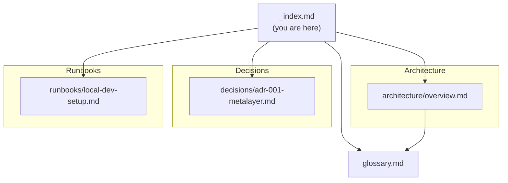

# next-forge Knowledge Graph

> [!context]
> This is the entry point for the next-forge knowledge system. Every agent session should start here to understand the codebase topology, conventions, and decision history before making changes.

## Graph Map

## Tag Taxonomy

| Prefix | Values | Purpose |
|--------|--------|---------|
| `domain/` | project-specific domains | Which subsystem the note covers |
| `status/` | `draft`, `active`, `deprecated` | Note lifecycle |
| `type/` | `architecture`, `api-contract`, `decision`, `runbook`, `schema`, `index`, `glossary`, `template` | Document type |

## Traversal Instructions

1. **Start here** — read this index to orient yourself in the knowledge graph
2. **Understand the system** — read [[architecture/overview]] and [[glossary]]
3. **Find the relevant subsystem** — follow links to specific architecture notes
4. **Check for decisions** — before proposing alternatives, read relevant ADRs
5. **Follow runbooks** — for operational tasks, use the runbook for that workflow
6. **Use templates** — when creating new docs, copy from the `_templates/` directory

## Document Registry

### Architecture
- [[architecture/overview]] — System architecture overview

### Decisions
- [[decisions/adr-001-metalayer]] — Why the control metalayer pattern

### Runbooks
- [[runbooks/local-dev-setup]] — Getting started from scratch

### Glossary
- [[glossary]] — Key terms and definitions
