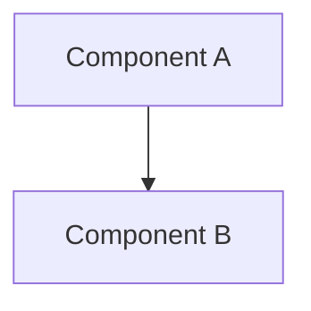

# [Component/System Name]

> [!context]
> Brief description of what this component/system does and why it exists.

## Overview

<!-- High-level description -->

## Architecture Diagram

## Key Components

| Component | File/Path | Purpose |
|-----------|-----------|---------|
| | | |

## Dependencies

| Dependency | Usage |
|------------|-------|
| | |

## Related

- [[architecture/overview]]
