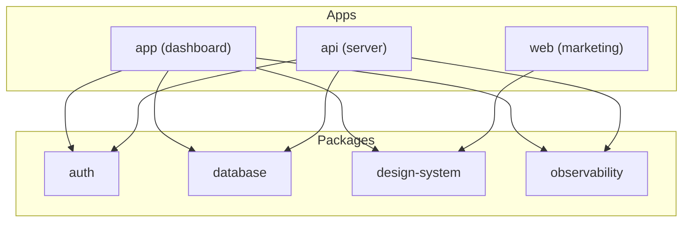

# Architecture Overview

> [!context]
> High-level architecture of next-forge. This document describes the system topology, key components, and how they interact.

## System Diagram

## Apps

| App | Port | Description |
|-----|------|-------------|
| `apps/app` | 3000 | Main dashboard application |
| `apps/api` | 3002 | API server |
| `apps/web` | 3001 | Marketing website |
| `apps/docs` | 3004 | Public documentation |
| `apps/email` | 3003 | Email templates |
| `apps/storybook` | 6006 | Component explorer |

## Packages

See `.control/topology.yaml` for the full package map with dependencies.

## Related

- [[glossary]]
