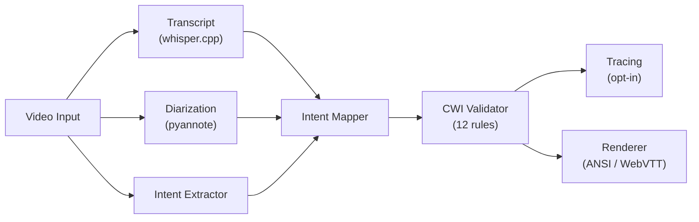
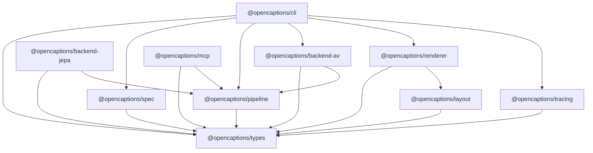

# Architecture Overview

> [!context]
> High-level architecture of OpenCaptions — an open-source CWI (Caption with Intention) video understanding pipeline. Built on next-forge (Turborepo + Next.js) with symphony-forge metalayer.

## CWI Pipeline

The core pipeline extracts cinematic intent from video and renders it as CWI-compliant captions.

```
VideoInput
  -> TranscriptBackend (V1: whisper.cpp)
  -> DiarizationBackend (V1: pyannote-audio)
  -> IntentExtractorBackend (V1: audio+vision, V2: V-JEPA2, V3: TRIBE v2)
  -> IntentMapper (V1: RulesMapper, V2: LearnedMapper, V3: NeuralMapper)
  -> CWIValidator -> ValidationReport
  -> TracingCollector (opt-in feedback flywheel)
```

### Pipeline Flow Diagram



## Package Dependency Graph



## Mapper Versions

The IntentMapper translates raw extracted features (pitch, volume, emotion, pacing) into CWI styling parameters (color, weight, size, timing).

| Version | Name | Strategy | Phase |
|---------|------|----------|-------|
| V1 | **RulesMapper** | Pure math (lerp interpolation). Deterministic, zero training data needed. Ships as default. | Phase 1 (now) |
| V2 | **LearnedMapper** | Trained on correction data from the tracing flywheel. Adapts to real-world reviewer feedback. | Phase 3 |
| V3 | **NeuralMapper** | Brain ROI activations (TRIBE v2) mapped to CWI styling. Captions represent what the viewer's brain WOULD FEEL. | Phase 3.5 |

## Apps (next-forge surfaces)

The three next-forge apps map to OpenCaptions product surfaces:

| App | Port | OpenCaptions Surface |
|-----|------|---------------------|
| `apps/web` | 3001 | Landing page (opencaptions.tools) |
| `apps/app` | 3000 | Dashboard (reports, badges, billing) |
| `apps/api` | 3002 | Hosted pipeline API |
| `apps/docs` | 3004 | Public documentation |
| `apps/email` | 3003 | Email templates |
| `apps/storybook` | 6006 | Component explorer |

## Staircase Pricing

```
Free CLI          -- unlimited local use, ANSI + WebVTT output
Starter  $9/mo    -- hosted API (100 minutes/mo), dashboard, badge embed
Pro      $29/mo   -- 500 minutes/mo, priority queue, team seats
Studio   $99/mo   -- 2000 minutes/mo, bulk batch, custom branding
Enterprise        -- unlimited, SLA, on-prem, NeuralMapper access
```

## Infrastructure Packages

The next-forge infrastructure packages provide shared services:

| Package | Description |
|---------|-------------|
| `@repo/auth` | Better Auth (dashboard login) |
| `@repo/database` | Prisma (report storage) |
| `@repo/design-system` | shadcn/ui components |
| `@repo/observability` | Logging, error tracking, monitoring |
| `@repo/typescript-config` | Shared TypeScript configuration |

See `.control/topology.yaml` for the full package map with dependencies.

## Related

- [[glossary]]
- [[runbooks/local-dev-setup]]
